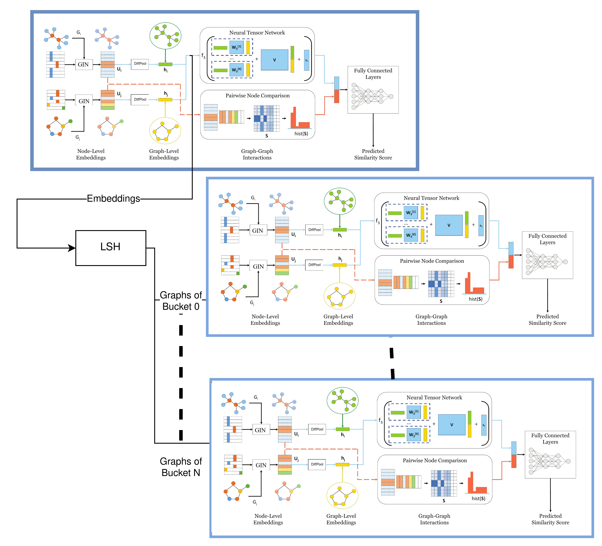

Extended SimGNN with LSH
============================================

A pair-wise graph similarity learning pipeline utilizing Deep Learning (DL) and Locality Sensitive Hashing (LSH). 

The DL model used is based on a PyTorch Geometric implementation of "SimGNN: A Neural Network Approach to Fast Graph Similarity Computation" (WSDM 2019) [[Paper]](http://web.cs.ucla.edu/~yzsun/papers/2019_WSDM_SimGNN.pdf). While the initial implementation is done in [[benedekrozemberczki/SimGNN]](https://github.com/benedekrozemberczki/SimGNN) the basis implementation for this repository is the [[gospodima/Extended-SimGNN]](https://github.com/gospodima/Extended-SimGNN) extention that added the Graph Isomorphism Operator from the [“How Powerful are Graph Neural Networks?”](https://arxiv.org/abs/1810.00826) paper and the Differentiable Pooling Operator from the ["Hierarchical Graph Representation Learning with Differentiable Pooling"](https://arxiv.org/abs/1806.08804) paper.

This implementation was written and used to conduct experiments for my bachelor thesis "Pair-wise graph similarity learning with Graph Convolutional Networks and Locality Sensitive Hashing" at the [Informatics Department](https://www.dept.aueb.gr/en/cs) of Athens University of Economics and Business [(AUEB)](https://www.aueb.gr/en), under the mentorship of [Prof. Ioannis Kotidis](https://www.aueb.gr/en/faculty_page/kotidis-ioannis). 

The paper's original reference implementation is accessible [here](https://github.com/yunshengb/SimGNN) in Tensorflow.

### Example illustration of the pipeline
<p align="center">
  
</p>
<p align="justify">
  
### Requirements
The codebase is implemented in **Python 3.6** and needed package versions used for development are below. **CUDA 10.1** needs to be installed.
```
lshashpy3==0.0.8
texttable==1.6.2
torch==1.5.0+cu101
torch-cluster==1.5.7
torch-geometric==1.4.3
torch-scatter==2.0.5
torch-sparse==0.6.7
torch-spline-conv==1.2.0
torchvision==0.6.0+cu101
tqdm==4.48.2
```
Other packages like `numpy` or `matplotlib` are installed as dependencies.

### Installation guide (for systems with CUDA compatible GPU):
To get up and running:

- Ensure that **CUDA** is properly installed on your system, and that **Python** is installed in your system.
  - Check you have the versions mentioned above.
- Create and activate a **virtualenv** with the correct Python version, to continue with the installation. ([Help](https://www.youtube.com/watch?v=N5vscPTWKOk))
- Install **torch** with `pip install torch==1.5.0+cu101 torchvision==0.6.0+cu101 -f https://download.pytorch.org/whl/torch_stable.html`. This command is based on [this site](https://pytorch.org/get-started/previous-versions/#v150).
- Install **torch-geometric** packages, as written [here](https://pytorch-geometric.readthedocs.io/en/latest/notes/installation.html#installation-via-binaries).
    - Note: For torch-geometric package explicitly install version **1.4.3**.
    - The commands:
    ```
    pip install torch-scatter==2.0.5+cu101 -f https://pytorch-geometric.com/whl/torch-1.5.0.html
    pip install torch-sparse==0.6.7+cu101 -f https://pytorch-geometric.com/whl/torch-1.5.0.html
    pip install torch-cluster==1.5.7+cu101 -f https://pytorch-geometric.com/whl/torch-1.5.0.html
    pip install torch-spline-conv==1.2.0+cu101 -f https://pytorch-geometric.com/whl/torch-1.5.0.html
    pip install torch-geometric==1.4.3
    ```
- Install **additional packages** by utilizing the [_extra_packages.txt_](https://github.com/Chuhtra/Extended-SimGNN-with-LSH/blob/master/extra_packages.txt) file with `pip install -r extra_packages.txt`.

### Notes on source code
- To get the information of the result files in `example_results` folder, the wanted `temp_runfiles (Dataset)` folder needs to be moved to the same level with the `src` folder, and run the `mainForResults.py` file.
  - Caution: Running the `main.py` script with Dataset A, always cleans the `temp_runfiles (A)` folder.
- The pipeline is currently not compatible with PyGeometric beyond version 1.4.3.
- **Caution:** In order to run the pipeline (with PyGeometric v.1.4.3), a manual edit must be done in the PyTorch Geometric code.
    - Specifically, in file `ged_dataset.py` and line 157 (see the commit that fixed it for v.1.5.0 [here](https://github.com/rusty1s/pytorch_geometric/commit/9d01a7bc482a45b05a9d7fadc36d72b75e0766e5)).
    - Relevant [issue](https://github.com/rusty1s/pytorch_geometric/issues/1189).
    - This is of course only a temporary fix to get the code running. 
- The code for generating and using synthetic data and for the 'measure time' functionality are removed because I didn't test it, but it might turn out useful in the future.
- Also some the code of some early tries to incorporate [GatedGCN](https://arxiv.org/abs/1711.07553), is left in comments.

### Datasets
The datasets are loaded with the help of [GEDDataset](https://pytorch-geometric.readthedocs.io/en/latest/modules/datasets.html#torch_geometric.datasets.GEDDataset),
where the databases specified in the [original repository](https://github.com/yunshengb/SimGNN) with GED-values are used. 
Currently AIDS700nef, LINUX and IMDBMulti databases are supported.

### Options
Training a SimGNN model is handled by the `src/main.py` script which provides the following command line arguments.

#### Input and output options for main.py
```
  --dataset               STR         Name of the dataset to be used.          Default is `AIDS700nef`.
  --plot-loss             BOOL        Plot mse values during the learning.     Default is False.
```
#### Model options
```
  --diffpool              BOOL        Differentiable pooling.                  Default is True.
  --gnn-operator          STR         Type of gnn operator.                    Default is gin.
  --use-lsh               BOOL        Flag for using or not the LSH model.     Default is True.
  --filters-1             INT         Number of filter in 1st GNN layer.       Default is 64.
  --filters-2             INT         Number of filter in 2nd GNN layer.       Default is 32. 
  --filters-3             INT         Number of filter in 3rd GNN layer.       Default is 32.
  --tensor-neurons        INT         Neurons in tensor network layer.         Default is 16.
  --bottle-neck-neurons   INT         Bottle neck layer neurons.               Default is 16.
  --bins                  INT         Number of histogram bins.                Default is 16.
  --batch-size            INT         Number of pairs processed per batch.     Default is 128. 
  --epochs                INT         Number of SimGNN training epochs.        Default is 350.
  --dropout               FLOAT       Dropout rate.                            Default is 0.
  --learning-rate         FLOAT       Learning rate.                           Default is 0.001.
  --weight-decay          FLOAT       Weight decay.                            Default is 5*10^-4.
  --histogram             BOOL        Include histogram features.              Default is True.
```
